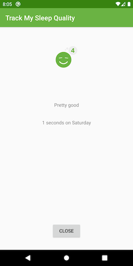

# udacity-sleep-tracker

This is a continuation of the app developed in class 6 for lesson 7 of the [Android App Development in Kotlin course on Udacity](https://www.udacity.com/course/developing-android-apps-with-kotlin--ud9012).

This app is not my own, but the team that developed the course.

## SleepQualityTracker with RecyclerView

This app builds on the SleepQualityTracker you developed in Lesson 6.  In this lesson you'll learn how to display a list of results in a RecyclerView instead of a static ScrollView. You'll also learn how you can refactor your code to make it more efficient so it will be easier to maintain and test.

## SleepQualityTracker

The SleepQualityTracker app is a demo app that helps you collect information about your sleep. 
* Start time
* End time
* Quality
* Time slept

This app demonstrates the following views and techniques:
* RecyclerView
* Adapter
* ViewHolder
* LinearLayoutManager
* GridLayoutManager

It also uses and builds on the following techniques from previous lessons:
* Transformation map
* Data Binding in XML files
* ViewModel Factory
* Using Backing Properties to protect MutableLiveData
* Observable state LiveData variables to trigger navigation
* Room database
* DAO
* Coroutines

## Screenshots

